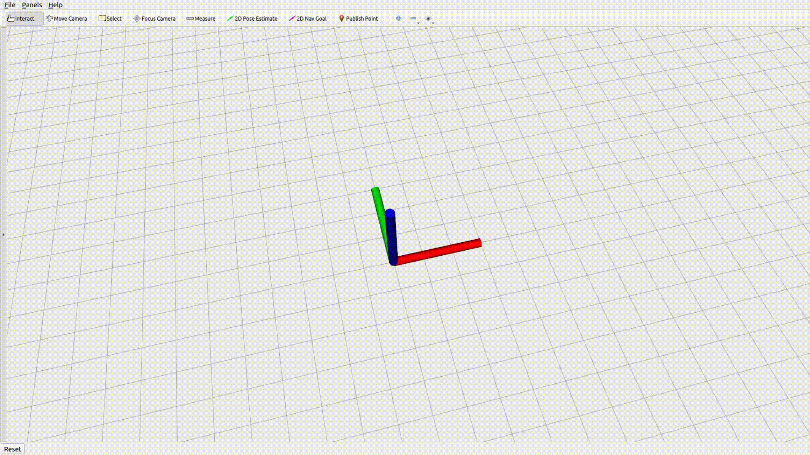

# MARTS-Planner
Code for paper "Safe and Agile Transportation of Cable-Suspended Payload via Multiple Aerial Robots"

## Applications

### 1. Requirements
The code is tested on clean Ubuntu 20.04 with ROS noetic installation.
Install the required packages.

    sudo apt update
    sudo apt install cpufrequtils
    sudo apt install libompl-dev

### 2. Download and compile the code
Download the code.

    mkdir transport-multiple; cd transport-multiple; mkdir src; cd src
    git clone https://github.com/WwwangJJ/MARTS-Planner.git
    cd ..

Compile the code.

    catkin_make -DCATKIN_WHITELIST_PACKAGES="quadrotor_msgs"
    catkin_make -DCATKIN_WHITELIST_PACKAGES=""

### 3. Run the replan mode

    roslaunch gcopter global_planning.launch

After conduct the command, you will see the window for rviz. Please follow the gif below for trajectory planning in a random map.
    

    

